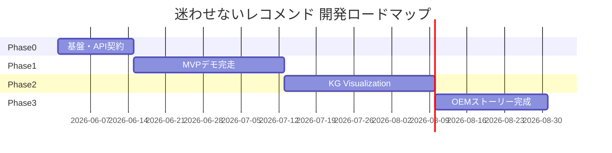

# 開発計画書

> **プロジェクト**: Decision Intelligence — 迷わせないレコメンド  
> **ソース**: `docs/output/detailed_requirements_specification.md` §3.3, §10, §11  
> **バージョン**: 1.0 | **作成日**: 2026-05-26

---

## 1. 開発方針

| 項目 | 内容 |
|------|------|
| **モデル** | アジャイル・フェーズ分割（Phase 0〜3） |
| **優先** | デモ完走 > 本番機能 > 最適化 |
| **資産活用** | FastAPI / Neo4j v3 / recommendation_engine は拡張、FE は新規 |
| **キックオフ** | 2026年6月 `(仮定)` |
| **総期間** | 9〜13 週間 |

---

## 2. 開発ロードマップ

### 2.1 フェーズ概要

### 2.2 Phase 0: 基盤整備（1〜2 週間）

| 目標 | 技術検証完了、API 契約確定、FE 雛形 |
|------|----------------------------------|
| **成果物** | OpenAPI ドラフト、Next.js 雛形、Supabase migration、デザインシステム |

| タスク | 担当目安 |
|--------|---------|
| Neo4j v3 推薦回帰テスト | BE |
| Quick Questions → Need マッピング JSON | BE |
| `POST /api/demo/sessions` 実装 | BE |
| Next.js + Tailwind + デザイントークン | FE |
| Supabase テーブル作成 | BE/Infra |
| fallback JSON 作成 | BE |

### 2.3 Phase 1: MVP（3〜4 週間）

| 目標 | 内部リハーサルで 7 分ルート完走（SCR 1-3 + 簡易 5） |
|------|--------------------------------------------------|
| **成果物** | 内部デモビルド |

**含む画面**: SCR-01, SCR-02, SCR-03, SCR-05（簡易）  
**含む機能**: F-001〜004, F-006（簡易）, F-009, F-011, F-012

### 2.4 Phase 2: KG 主役（3〜4 週間）

| 目標 | コンセプトの核心（説明可能性）を体験できる |
|------|----------------------------------------|
| **成果物** | コンセプトデモビルド |

**追加**: SCR-04 フル、SCR-05 完全版（なぜ外したか、Delegation 連動）、F-005, F-010

### 2.5 Phase 3: OEM ストーリー（2〜3 週間）

| 目標 | ショールーム本番 v1.0 |
|------|----------------------|
| **成果物** | 本番デモ + オペレーターガイド |

**追加**: SCR-06, SCR-07, F-007, F-008, F-013

### 2.6 v1.0 定義

| 項目 | 内容 |
|------|------|
| **v1.0** | Phase 3 完了時点のショールームデモ |
| **完了条件** | 7 画面完走、オフライン fallback、7 分台本、投影確認済み |

---

## 3. タスク分解（WBS）

### 3.1 Phase 1 MVP — 機能別

| WBS ID | タスク | 機能 ID | 工数目安 |
|--------|--------|---------|---------|
| W1.1 | Supabase migration 適用 | — | 0.5d |
| W1.2 | セッション API 実装 | F-001 | 1d |
| W1.3 | 回答 API + スコア計算 | F-003, F-012 | 2d |
| W1.4 | Opening 画面 + 浮遊カード | F-002 | 2d |
| W1.5 | Quick Questions 画面 | F-003 | 3d |
| W1.6 | Delegation 画面 | F-004 | 2d |
| W1.7 | `/recommend` 拡張・FE 連携 | F-006, F-009 | 2d |
| W1.8 | Recommendation 画面（簡易） | F-006 | 2d |
| W1.9 | デモモード fallback | F-011 | 1d |
| W1.10 | デモフロー・プログレスバー | F-001 | 1d |
| W1.11 | E2E 手動テスト・台本 | — | 1d |

**Phase 1 合計**: 約 17.5 人日 `(FE 10 / BE 7.5 想定)`

### 3.2 Phase 2 — 機能別

| WBS ID | タスク | 機能 ID | 工数目安 |
|--------|--------|---------|---------|
| W2.1 | graph-path API + Cypher | F-010 | 3d |
| W2.2 | KnowledgeGraphView コンポーネント | F-005 | 5d |
| W2.3 | WhyPanel + ナレーション | F-005 | 2d |
| W2.4 | Recommendation 完全版 | F-006 | 2d |
| W2.5 | パフォーマンスチューニング | NFR-02 | 2d |
| W2.6 | 投影・リハーサル | — | 1d |

### 3.3 Phase 3 — 機能別

| WBS ID | タスク | 機能 ID | 工数目安 |
|--------|--------|---------|---------|
| W3.1 | dealer-talk API（LLM+テンプレ） | F-013 | 2d |
| W3.2 | Dealer Support 画面 | F-007 | 2d |
| W3.3 | AXIS Closing 画面 | F-008 | 1d |
| W3.4 | オペレーターガイド・リセット | — | 1d |
| W3.5 | 本番リハーサル | — | 2d |

### 3.4 コンポーネント別（FE）

| コンポーネント | Phase | 依存 |
|---------------|-------|------|
| `demoStore` (Zustand) | 1 | — |
| `api-client.ts` | 1 | BE API |
| `QuestionCard` | 1 | W1.3 |
| `ProfileMap` | 1 | W1.3 |
| `DelegationSelector` | 1 | W1.6 |
| `RecommendationCard` | 1 | W1.7 |
| `KnowledgeGraphView` | 2 | W2.1 |
| `WhyPanel` | 2 | W2.1 |
| `DemoBanner` | 1 | W1.9 |

---

## 4. マイルストーン

| 日付 `(仮定)` | マイルストーン | 判定基準 |
|--------------|---------------|---------|
| 6月中旬 | Phase 0 完了 | API 契約レビュー OK |
| 7月中旬 | Phase 1 完了 | 内部 7 分デモ完走 |
| 8月中旬 | Phase 2 完了 | KG 画面 5 秒以内 |
| 9月上旬 | **v1.0 リリース** | ショールーム本番リハーサル OK |

---

## 5. リスク管理

| No | カテゴリ | リスク | 影響 | 確率 | 対策 | 担当 |
|----|---------|--------|------|------|------|------|
| R1 | 技術 | Neo4j FW ブロック | 高 | 中 | ローカル Desktop + JSON fallback | Infra |
| R2 | 技術 | KG 描画パフォーマンス | 中 | 中 | ノード上限 50、モック | FE |
| R3 | 技術 | v3 オントロジー不整合 | 高 | 低 | Cypher 回帰テスト CI | BE |
| R4 | 技術 | LLM レイテンシ | 中 | 中 | テンプレート先行 | BE |
| R5 | ビジネス | ただのレコメンドに見える | 高 | 中 | SCR 4・6 必須台本 | PM |
| R6 | ビジネス | デモと本番のギャップ | 中 | 高 | Closing で明示 | PM |
| R7 | 法的 | レビューデータ利用 | 高 | 低 | 匿名化・法務確認 | 法務 |
| R8 | 運用 | デモ当日障害 | 高 | 中 | オフライン完走手順 | 運用 |
| R9 | 運用 | オペレーター習熟不足 | 中 | 中 | 7 分台本・2 回リハ | 運用 |

### 5.1 リスク監視

- 週次: Phase バーンダウン、ブロッカー（Neo4j 接続、API 遅延）
- Phase 末: デモ完走テスト、KPI 計測（完走率・体験時間）

---

## 6. 体制・コミュニケーション `(仮定)`

| ロール | 人数 | 責務 |
|--------|------|------|
| PM / 台本 | 1 | スコープ、プレゼン、OEM 調整 |
| FE (Next.js) | 1〜2 | UI/UX 実装 |
| BE (Python) | 1 | API、Neo4j、LLM |
| デザイン | 0.5 | トークン、投影確認 |

**定例**: 週 2 回スタンドアップ、Phase 末デモ

---

## 7. 完了定義（DoD）

| 項目 | 基準 |
|------|------|
| 機能 | MoSCoW Must が Phase 該当分すべて完了 |
| 品質 | 手動 E2E 完走、推薦スコア > 0% |
| ドキュメント | 設計書 v1.0、オペレーターガイド |
| デモ | 7〜10 分、プロジェクター視認 OK |
| fallback | Neo4j 停止時も完走 |

---

## 8. 参考資料

- `docs/output/detailed_requirements_specification.md`
- `docs/design/system-architecture.md`
- `docs/design/api-specification.md`
