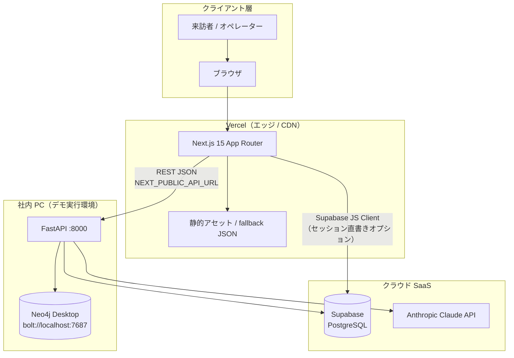
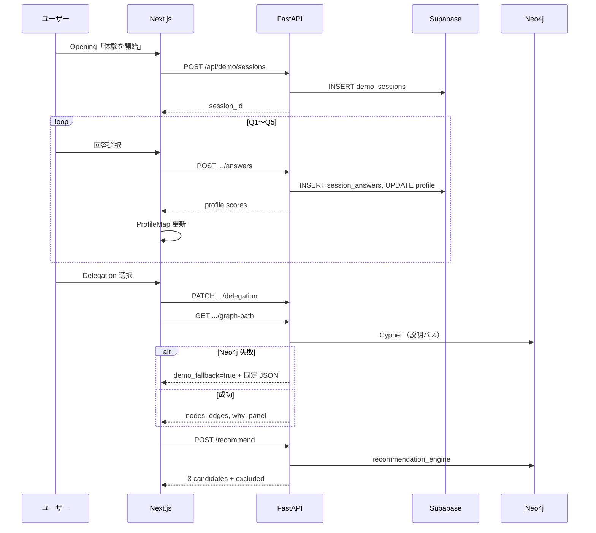
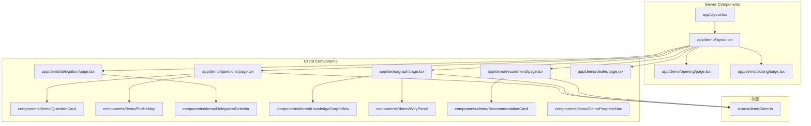

# システムアーキテクチャ設計書

> **プロジェクト**: Decision Intelligence — 迷わせないレコメンド（ショールームデモモック）  
> **ソース**: `docs/output/detailed_requirements_specification.md` §9  
> **バージョン**: 1.0 | **作成日**: 2026-05-26

---

## 1. 概要

本システムは、OEM 本部長向けショールームデモとして **説明可能な Knowledge Graph レコメンド体験** を提供する。フロントエンドは **Next.js 15 + TypeScript** を **Vercel** にデプロイし、セッション・推薦・グラフ探索は **FastAPI + Neo4j**（既存 PoC 拡張）が担う。デモセッションの永続化には **Supabase (PostgreSQL)** を利用する。

---

## 2. 技術スタック

| レイヤ | 技術 | バージョン目安 | 選定理由 |
|--------|------|---------------|----------|
| **フロントエンド** | Next.js (App Router) | 15.x | 7 画面のリッチ UI・アニメーション、RSC/Client 分離、Vercel 最適化 |
| **言語** | TypeScript | 5.x | 型安全な Props/API 契約、コンポーネント設計 |
| **スタイリング** | Tailwind CSS | 3.x | デザイントークン一元管理、高速プロトタイピング |
| **状態管理** | Zustand | 4.x | デモセッションの軽量グローバル状態 |
| **KG 可視化** | react-force-graph-2d | 1.x | ノード種別スタイル・インタラクション |
| **アニメーション** | Framer Motion | 11.x | 画面遷移・棒グラフ・カード発光 |
| **BaaS / DB** | Supabase (PostgreSQL) | — | セッション・回答・イベントログ（Auth は Phase 4） |
| **API** | FastAPI | 0.11+ | 既存 `api/api_server.py`・`recommendation_engine` 再利用 |
| **ランタイム (API)** | Python | 3.11+ | PoC 資産との整合 |
| **グラフ DB** | Neo4j | 5.x | v3 オントロジー、説明パス Cypher |
| **LLM** | Anthropic Claude API | — | 販売店トーク生成（Phase 3） |
| **ホスティング (FE)** | Vercel | — | Preview/Production、HTTPS 標準 |
| **ホスティング (BE)** | 社内 PC（ローカル） | — | 企業 FW により Bolt 7687 ブロック時は Neo4j Desktop 必須 |

### 2.1 ハイブリッド構成の理由

| 候補 | 不採用/採用理由 |
|------|----------------|
| 全スタック Supabase のみ | KG パス探索は RDB より Neo4j が適する |
| Streamlit 継続 | ショールーム品質の UI・KG アニメーションに不足 |
| **Next.js + FastAPI + Neo4j** | **採用** — FE 新規、BE/グラフは PoC 拡張で最短デリバリー |

---

## 3. アーキテクチャ概要図



### 3.1 コンポーネント役割

| コンポーネント | 役割 |
|---------------|------|
| **Next.js (Vercel)** | 7 画面デモ UI、クライアント状態、KG 描画、API 呼び出し |
| **FastAPI** | ビジネスロジック、Neo4j Cypher、推薦スコア、LLM プロキシ |
| **Neo4j** | 購入者グラフ（4,205 件）、Need/Capability/車種の説明パス |
| **Supabase** | デモセッション ID、Quick Questions 回答、プロファイルスコア、画面遷移ログ |
| **静的 JSON** | `DEMO_MODE=true` 時の graph-path / recommend fallback |
| **Claude API** | Dealer Support トーク生成（テンプレート fallback 併用） |

### 3.2 データフロー（推薦まで）



---

## 4. コンポーネント設計（Next.js App Router）

### 4.1 コンポーネント階層図



### 4.2 Server / Client 区分方針

| 区分 | 基準 | 例 |
|------|------|-----|
| **Server Component** | 静的コピー、SEO 不要、インタラクションなし | Opening, Closing, layout |
| **Client Component** | useState/useEffect、ブラウザ API、グラフライブラリ | Questions, Graph, Recommend |
| **境界** | ページ単位で `"use client"`、子は極力 Client に集約 | `questions/page.tsx` |

### 4.3 主要コンポーネント定義

#### `KnowledgeGraphView`

```typescript
// components/demo/KnowledgeGraphView.tsx — Client Component

export type GraphNodeType =
  | "person" | "value" | "lifestyle" | "load"
  | "experience" | "feature" | "vehicle";

export interface GraphNode {
  id: string;
  type: GraphNodeType;
  label: string;
  subtype?: string;
  score?: number;
}

export interface GraphEdge {
  source: string;
  target: string;
  label?: string;
  highlighted?: boolean;
}

export interface KnowledgeGraphViewProps {
  sessionId: string;
  nodes: GraphNode[];
  edges: GraphEdge[];
  animationPhase: number;        // 0〜6: 段階表示
  demoFallback?: boolean;
  onAnimationComplete?: () => void;
}

// 状態: animationPhase (useState), graphRef
// 副作用: phase ごとに visibleNodeIds をフィルタ
// 依存: react-force-graph-2d（dynamic import, ssr: false）
```

#### `ProfileMap`

```typescript
export interface ProfileScores {
  safety: number;
  family: number;
  efficiency: number;
  enjoyment: number;
  adventure: number;
}

export interface ProfileMapProps {
  scores: ProfileScores;
  animated?: boolean;
  className?: string;
}

// データソース: Zustand demoStore.profile または props
// アニメーション: Framer Motion layout on width %
```

#### `DelegationSelector`

```typescript
export type DelegationLevel = "guide" | "co_pilot" | "auto";

export interface DelegationSelectorProps {
  value: DelegationLevel;
  onChange: (level: DelegationLevel) => void;
  defaultLevel?: DelegationLevel; // co_pilot
}

// 下部メッセージ: DELEGATION_MESSAGES[level]
```

### 4.4 状態管理（Zustand）

```typescript
// stores/demoStore.ts

interface DemoState {
  sessionId: string | null;
  profile: ProfileScores | null;
  mappedNeeds: string[];
  delegationLevel: DelegationLevel;
  recommendations: RecommendationItem[];
  excluded: ExcludedItem[];
  demoFallbackUsed: boolean;

  setSessionId: (id: string) => void;
  setProfile: (profile: ProfileScores, needs: string[]) => void;
  setDelegation: (level: DelegationLevel) => void;
  setRecommendations: (items: RecommendationItem[], excluded: ExcludedItem[]) => void;
  reset: () => void;
}
```

| データ | 永続化 | 備考 |
|--------|--------|------|
| sessionId | Supabase + メモリ | Opening 時に API 発行 |
| profile | Supabase + Zustand | 各回答 POST 後に同期 |
| recommendations | Zustand のみ | Recommend 画面で API 取得 |

### 4.5 ディレクトリ構成（案）

```
demo-mock-fe/
├── app/
│   ├── layout.tsx
│   └── demo/
│       ├── layout.tsx
│       ├── opening/page.tsx
│       ├── questions/page.tsx
│       ├── delegation/page.tsx
│       ├── graph/page.tsx
│       ├── recommend/page.tsx
│       ├── dealer/page.tsx
│       └── closing/page.tsx
├── components/demo/
│   ├── QuestionCard.tsx
│   ├── ProfileMap.tsx
│   ├── DelegationSelector.tsx
│   ├── KnowledgeGraphView.tsx
│   ├── WhyPanel.tsx
│   ├── RecommendationCard.tsx
│   └── DemoBanner.tsx
├── lib/
│   ├── api-client.ts          # FastAPI ラッパー
│   ├── score-calculator.ts    # ローカル fallback 用
│   └── constants/questions.ts
├── stores/demoStore.ts
└── public/demo/fallback/
    ├── graph-path.json
    └── recommend.json
```

---

## 5. 環境変数

### 5.1 フロントエンド（Vercel）

| 変数 | 説明 | 例 |
|------|------|-----|
| `NEXT_PUBLIC_API_URL` | FastAPI ベース URL | `http://localhost:8000` |
| `NEXT_PUBLIC_SUPABASE_URL` | Supabase プロジェクト URL | — |
| `NEXT_PUBLIC_SUPABASE_ANON_KEY` | Supabase anon key | — |
| `NEXT_PUBLIC_DEMO_MODE` | `true` で静的 fallback 優先 | `false` |

### 5.2 バックエンド（FastAPI）

| 変数 | 説明 |
|------|------|
| `NEO4J_URI` | `bolt://localhost:7687` |
| `NEO4J_USER` / `NEO4J_PASSWORD` | Neo4j 認証 |
| `ANTHROPIC_API_KEY` | Claude API |
| `SUPABASE_URL` / `SUPABASE_SERVICE_KEY` | サーバー側 DB 書き込み |
| `DEMO_MODE` | オフライン fallback 強制 |

---

## 6. 非機能アーキテクチャ上の考慮

| 要件 ID | アーキテクチャ対応 |
|---------|------------------|
| NFR-01 | API 並列抑制、楽観 UI 更新、ローカルスコア fallback |
| NFR-02 | graph-path キャッシュ、ノード上限 50、デモ JSON |
| NFR-05/06 | 二重データソース（Neo4j + JSON）、DemoBanner コンポーネント |
| NFR-14 | Vercel HTTPS、FastAPI CORS 許可リスト |

---

## 7. 参考資料

- `docs/output/detailed_requirements_specification.md`
- `CLAUDE.md`（Neo4j v3 スキーマ）
- `api/api_server.py`（既存 API）
