# UI/UX 設計書

> **プロジェクト**: Decision Intelligence — 迷わせないレコメンド  
> **ソース**: `docs/output/detailed_requirements_specification.md` §5, `docs/input/Decision_Intelligence.md`  
> **バージョン**: 1.0 | **作成日**: 2026-05-26

---

## 1. デザインコンセプト

### 1.1 コンセプトステートメント

**Calm Premium × Explainable First**

選択過多の時代に、ユーザーを主人公として理解し、AI に支配されず、**なぜその提案か**が見える体験を提供する。

| キーワード | 表現 |
|-----------|------|
| 余白 | セクション間 48px 以上、カード内 padding 24px |
| 信頼 | ネイビー基調、数値の明示、fallback 時の正直な表示 |
| 伴走 | Co-Pilot デフォルト、共感的コピー |
| 透明性 | KG + Why Panel が主役 |

### 1.2 避けること

- 赤の過剰使用（Load ノード以外）
- チカチカする点滅アニメ
- 「AI がおすすめします！」系の一方的コピー
- 10 件以上の選択肢を一度に表示

---

## 2. デザインシステム

### 2.1 カラーパレット

| トークン | HEX | RGB | 用途 |
|---------|-----|-----|------|
| `--color-navy` | `#1A365D` | 26, 54, 93 | 見出し、Primary ボタン背景 |
| `--color-navy-light` | `#2D5A8E` | 45, 90, 142 | ホバー、リンク |
| `--color-gold` | `#B8920C` | 184, 146, 12 | Recommended バッジ、アクセント |
| `--color-bg` | `#F5F7FA` | 245, 247, 250 | ページ背景 |
| `--color-surface` | `#FFFFFF` | 255, 255, 255 | カード |
| `--color-border` | `#E2E8F0` | 226, 232, 240 | 区切り線 |
| `--color-text` | `#0D1B2A` | 13, 27, 42 | 本文 |
| `--color-text-muted` | `#94A3B8` | 148, 163, 184 | キャプション |
| `--color-load` | `#C53030` | 197, 48, 48 | Load ノード（bg: 20% opacity） |
| `--color-feature` | `#2B6CB0` | 43, 108, 176 | Feature ノード |
| `--color-success` | `#16A34A` | 22, 163, 74 | チェック、完了 |

**Tailwind マッピング例**

```js
// tailwind.config.ts
colors: {
  navy: { DEFAULT: '#1A365D', light: '#2D5A8E' },
  gold: '#B8920C',
}
```

### 2.2 タイポグラフィ

| ロール | フォント | サイズ | ウェイト | 行高 |
|--------|---------|--------|---------|------|
| Display (H1) | Noto Sans JP, Inter | 32px | 300 | 1.3 |
| H2 | 同上 | 24px | 400 | 1.4 |
| Body | 同上 | 16px | 400 | 1.6 |
| Caption | 同上 | 12px | 400 | 1.5 |
| Score（おすすめ度） | 同上 | 28px | 300 | 1.0 |
| Narration | 同上 | 18px | 400 | 1.5 |

**フォント読み込み**: `next/font/google` — Noto Sans JP + Inter

### 2.3 スペーシング・レイアウト

| トークン | 値 |
|---------|-----|
| コンテナ最大幅 | `1280px` |
| グリッド | 12 カラム、gap 24px |
| 角丸（カード） | `6px` |
| 角丸（ボタン） | `6px` |
| シャドウ（カード） | `0 1px 3px rgba(0,0,0,0.07)` |
| シャドウ（ホバー） | `0 4px 8px rgba(0,0,0,0.08)` |

### 2.4 コンポーネント（共通）

| コンポーネント | 仕様 |
|---------------|------|
| **PrimaryButton** | bg navy, text white, h 48px, min-w 200px, hover navy-light |
| **SecondaryButton** | border navy, text navy, bg transparent |
| **Card** | bg surface, border border, radius 6px, padding 24px |
| **ProgressBar** | h 8px, bg border, fill navy |
| **DemoBanner** | bg gold/10%, text navy, 「デモデータで表示中」 |

---

## 3. 画面一覧

| ID | 名称 | パス | 所要目安 | Server/Client |
|----|------|------|---------|---------------|
| SCR-01 | Opening | `/demo/opening` | 1 分 | Server |
| SCR-02 | Quick Questions | `/demo/questions` | 2 分 | Client |
| SCR-03 | AI Delegation | `/demo/delegation` | 1 分 | Client |
| SCR-04 | KG Visualization | `/demo/graph` | 2 分 | Client |
| SCR-05 | Recommendation | `/demo/recommend` | 1.5 分 | Client |
| SCR-06 | Dealer Support | `/demo/dealer` | 1 分 | Client |
| SCR-07 | AXIS Closing | `/demo/closing` | 0.5 分 | Server |

**共通 chrome**: 上部に薄いプログレスバー（7 ステップ中 N ステップ目）

---

## 4. 画面遷移図

```mermaid
flowchart LR
    START([開始]) --> SCR01[SCR-01 Opening]
    SCR01 -->|体験を開始する| SCR02[SCR-02 Questions]
    SCR02 -->|5問完了| SCR03[SCR-03 Delegation]
    SCR03 -->|推薦理由を見る| SCR04[SCR-04 Graph]
    SCR04 -->|おすすめを見る| SCR05[SCR-05 Recommend]
    SCR05 -->|販売店提案へ| SCR06[SCR-06 Dealer]
    SCR06 -->|購入後体験を見る| SCR07[SCR-07 Closing]
    SCR07 --> END([次の体験へ])

    SCR02 -.->|戻る| SCR01
    SCR03 -.->|戻る| SCR02
    SCR04 -.->|戻る| SCR03
    SCR05 -.->|戻る| SCR04
```



---

## 5. 主要画面ワイヤーフレーム

### 5.1 SCR-01: Opening

**目的**: SDV 時代の選択負荷課題を提示する。

**レイアウト**

| 領域 | コンポーネント | 仕様 |
|------|---------------|------|
| 中央 | `HeroTitle` | 「選択肢が多い時代」32px |
| 中央下 | `HeroSubtitle` | “最適なもの”を探すほど… 18px muted |
| 中央下 | `HeroBody` | SDV 本文、max-width 640px |
| 背景 | `FloatingCards` | EV/HEV/ADAS… 10 種、CSS animation 浮遊 |
| 下部中央 | `PrimaryButton` | 「体験を開始する」 |

**インタラクション**

- CTA クリック → `POST /api/demo/sessions` → `/demo/questions` へ
- カードは `pointer-events: none`（装飾のみ）

---

### 5.2 SCR-02: Quick Questions

**目的**: 5 問でユーザー理解・MAP 更新。

**レイアウト（1920×1080）**

```
┌─────────────────────────────────────────────────────────────┐
│ [Step 2/7]  ████████░░░░░░░░  Progress                       │
├──────────────────────────────┬──────────────────────────────┤
│ 60%                          │ 40%                          │
│  Q 2 / 5                     │  あなた理解 MAP               │
│  ─────────────               │  ─────────────               │
│  休日の過ごし方は？           │  安心    ████████ 84%         │
│                              │  家族    ███████ 78%          │
│  [家族中心] [一人時間]        │  効率    ██████ 65%           │
│  [アクティブ][学び][趣味]     │  楽しさ  ████ 42%             │
│                              │  冒険    ███ 28%              │
│         [ 次の質問 → ]        │                              │
└──────────────────────────────┴──────────────────────────────┘
```

**コンポーネント**

| 名前 | 種別 | 動作 |
|------|------|------|
| `QuestionCard` | 選択肢ボタン群 | 単一選択、クリックで API POST |
| `ProfileMap` | 横棒 5 本 | 回答後 300ms ease で幅アニメ |
| `QuestionProgress` | テキスト + バー | Q n/5 |

**質問マスタ**

| Q | 質問文 | 選択肢 |
|---|--------|--------|
| 1 | 車に求める価値は？ | 安心 / 楽しさ / 家族時間 / 効率 / ステータス |
| 2 | 休日の過ごし方は？ | 家族中心 / 一人時間 / アクティブ / 学び / 趣味 |
| 3 | 最も避けたい後悔は？ | 買ってから使わない / 家族不満 / 維持費 / すぐ飽きる / 機能不足 |
| 4 | 移動時のストレスは？ | 疲れる / 渋滞 / 駐車 / 操作が難しい / 情報が多い |
| 5 | AIとの付き合い方は？ | AIに決めてほしい / 候補だけ / 自分で選びたい |

**例外**: API 失敗時はローカル `score-calculator.ts` で MAP 更新（トースト警告）。

---

### 5.3 SCR-03: AI Delegation Level

**レイアウト**

| 領域 | 内容 |
|------|------|
| Header | H1「AIにどこまで任せますか？」+ サブコピー 2 行 |
| Main | 3 カード横並び（Guide / **Co-Pilot** / Auto） |
| Footer | 選択に応じたメッセージ（動的） |
| CTA | 「推薦理由を見る」 |

**カード仕様**

| Level | アイコン | タイトル | バッジ |
|-------|---------|---------|--------|
| guide | コンパス | 候補だけほしい | — |
| co_pilot | 伴走 | 一緒に考えてほしい | **推奨**（gold） |
| auto | AI | 最適案を提案してほしい | — |

**インタラクション**

- ホバー: `box-shadow` 発光（gold 10% opacity）
- 選択: border 2px navy + 軽い scale(1.02)
- デフォルト: `co_pilot` 選択済み

---

### 5.4 SCR-04: KG Visualization（最重要）

**レイアウト**: 左 55% グラフ / 右 45% Why Panel / 下部ナレーション + CTA

**左: KnowledgeGraphView**

| ノード type | 形状 | 色 |
|-------------|------|-----|
| person | 円 48px | navy fill |
| value | 丸角矩形 | surface + navy border |
| lifestyle | タグ（pill） | bg #EEF2F7 |
| load | 丸角矩形 | load color 20% bg |
| feature | 丸角矩形 | feature color |
| vehicle | カード | gold border if top |

**アニメーション**: phase 0→6 でノード・エッジを順次表示（各 800ms）。重要エッジは stroke アニメーション（dash offset）。

**右: WhyPanel**

| セクション | UI |
|-----------|-----|
| 重視価値 | 横棒グラフ（ProfileMap 同系） |
| 検出された負荷 | チェックリスト（✓ アイコン success 色） |
| 推薦ロジック | 式風テキスト（× と →） |

**下部: NarrationBar**

- 5 秒ごとに 3 メッセージローテーション
- フェード transition

**DemoBanner**: `demo_fallback=true` 時に画面上部に固定表示

---

### 5.5 SCR-05: Recommendation

**レイアウト**

| 領域 | 内容 |
|------|------|
| Header | H1 + サブコピー |
| Main | 3 × `RecommendationCard` |
| Sub | 「なぜ外した？」折りたたみリスト |
| Footer | 「販売店提案へ」 |

**RecommendationCard**

| 要素 | 仕様 |
|------|------|
| おすすめ度 | 28px 数値 + 「%」キャプション |
| プログレス | 幅 = score * 100% |
| ラベル | 安心重視型 / バランス型 / 楽しさ重視型 |
| Recommended | 1 位のみ gold バッジ |
| ホバー | Why Detail ツールチップ |

**Delegation 連動**

| Level | 表示 |
|-------|------|
| guide | 理由テキスト全文表示 |
| co_pilot | 標準 |
| auto | 数値・結論を強調、理由は 1 行 |

---

### 5.6 SCR-06: Dealer Support

| 左 50% | 右 50% |
|--------|--------|
| CustomerInsight カード | TalkScript カード（LLM/テンプレート） |
| 顧客タイプ・シーン・不安・価値観 | 提案トーク本文、読みやすい行間 |

下部: KPI カード 5 枚（アイコン + ラベル、数値は定性でも可）

---

### 5.7 SCR-07: AXIS Closing

- イラスト: 選ぶ → 乗る → 使いこなす → 生活が整う（横フロー）
- メッセージ: 購入後体験への拡張
- CTA: 「次の体験へ — AXIS」大ボタン

---

## 6. アクセシビリティ・デモ運用

| 項目 | 対応 |
|------|------|
| コントラスト | 本文 4.5:1 以上を目標 |
| キーボード | Tab 順序: 選択肢 → CTA |
| 投影 | 最小フォント 16px（キャプション除く） |
| reduced-motion | `prefers-reduced-motion` でアニメ短縮 |
| オペレーター | 画面左下に「← 戻る」「リセット」`(Could)` |

---

## 7. 参考資料

- `docs/input/Decision_Intelligence.md`
- 既存 `sales_app.py`（Lexus Intelligence Clean Design 参考）
- Neo4j Bloom, Apple 製品ページ（トーン参考）
