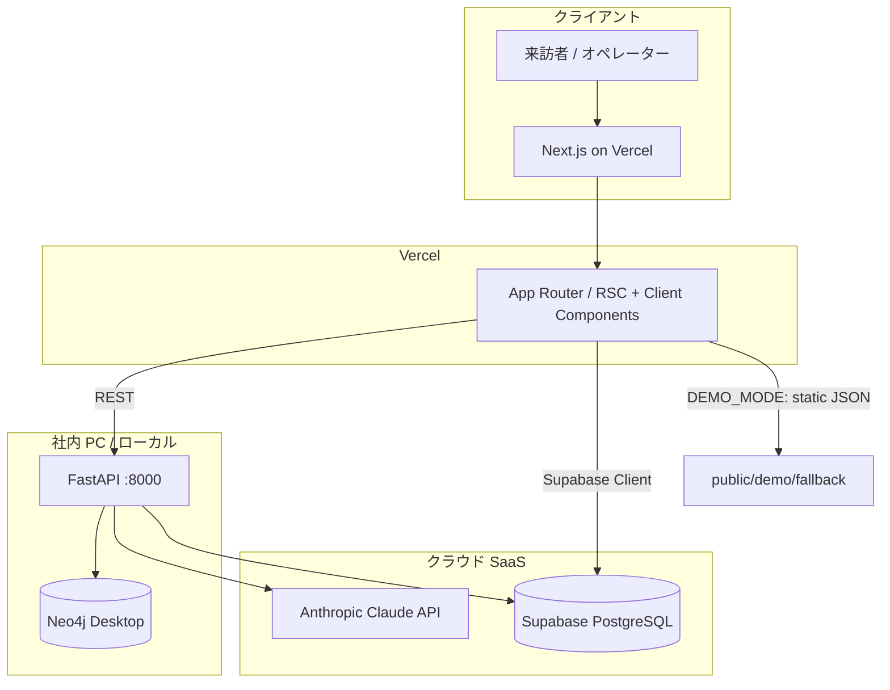
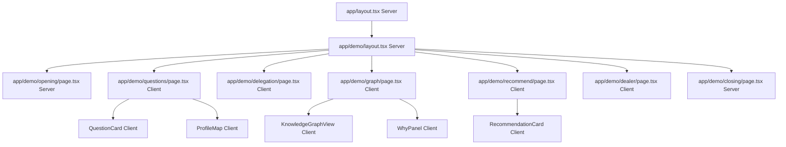

# 要件定義書 — 迷わせないレコメンド（ショールームデモモック）

> 本書は `docs/output/system_requirements.md` および `docs/input/Decision_Intelligence.md` を基に、`template/Requirements_Specification_Template.md` の構造に準拠して作成した。  
> 実装着手可能な粒度を目標とする。不足情報は `(仮定)` と明記する。

---

## 1. プロジェクト概要

### 1.1 プロジェクト名

**Decision Intelligence — 迷わせないレコメンド ショールームデモモック**

### 1.2 背景・目的

- **背景**: SDV 時代において車の機能・サービス・オプションは増え続ける一方、生活者は選択過多による判断負荷（メンタルパフォーマンス低下）を抱え、販売店も説明しきれない。生成 AI 単体の推薦は理由がブラックボックス化しやすく、属人的な商談スキルに依存する構造が続いている。
- **目的**: 自動車メーカー本部長向けショールームで **7〜10 分** の体験デモを完走し、Knowledge Graph による **説明可能な推薦（Explainability）** と **販売店資産化** のストーリーを伝える。定量目標として、デモ完走率 100%（オフライン fallback 含む）、来訪者の「AI が勝手に決めているわけではない」理解率を定性インタビューで 80% 以上 `(仮定)`。

### 1.3 システムのビジョン / スコープ

- **ビジョン**: 「人・価値観・生活・負荷・車両機能・商品」をグラフでつなぎ、生活者が納得して選び、販売店が再現可能なトークで提案できる **判断支援インフラ** となること。購入前（本デモ）から購入後（AXIS）まで拡張可能なプラットフォームの入口とする。
- **スコープ（含む）**:
  - 7 画面デモフロー（Opening → Quick Questions → AI Delegation → KG Visualization → Recommendation → Dealer Support → AXIS Closing）
  - Next.js フロントエンド（新規）
  - FastAPI バックエンド拡張（既存 PoC 活用）
  - Neo4j v3 グラフ連携・デモモード（オフライン JSON）
  - セッション管理・スコアリング・推薦・KG パス API
- **スコープ（含まない）**:
  - 販売店本番システム（DMS 連携・契約・在庫）
  - AXIS 実 API 連携（画面 7 はストーリーのみ）
  - モバイル最適化（Phase 4 以降）
  - 多言語（英語）— 初期は日本語のみ

---

## 2. ビジネス要件

### 2.1 ビジネスモデル情報（任意）

**リーンキャンバス要約** `(仮定: Decision_Intelligence.md およびシステム要件から推論)`

| ブロック | 内容 |
|---------|------|
| **解決する課題** | 選択過多・説明不可能な AI 推薦・販売店の属人商談 |
| **顧客セグメント** | OEM 本部経営層、DX 推進部門、販売店改革担当 |
| **価値提案** | 説明可能な KG レコメンド、判断負荷の軽減、商談トークの標準化 |
| **チャネル** | ショールームデモ、PoC 提案、AXIS への接続ストーリー |
| **収益構造** | ライセンス / コンサル / データプラットフォーム `(仮定・本フェーズはデモ投資)` |
| **コスト構造** | 開発（FE/BE）、Neo4j、LLM API、デモ運用 |
| **キーリソース** | 4,205 件購入者レビュー、v3 オントロジー、推薦エンジン |
| **キーアクティビティ** | デモ体験設計、グラフメンテナンス、OEM プレゼン |

**7Powers 視点の優位性** `(仮定)`

| Power | 当プロジェクトでの示唆 |
|-------|----------------------|
| **スケール経済** | 購入者データ・グラフが蓄積されるほど推薦精度・説明パスが向上 |
| **ネットワーク** | 販売店フィードバックがグラフに還流すれば強化 `(将来)` |
| **差別化** | Neo4j + 説明パス可視化は汎用 LLM チャット単体と差別化 |
| **プロセス** | 商談トークテンプレートの標準化 |

**市場規模**: 国内自動車販売店約 5 万拠 `(仮定)`。本フェーズは OEM 1 社向けデモが主対象。

### 2.2 成果指標（KPI/KGI）

| 指標 | 目標 | 計測方法 | 期限 `(仮定)` |
|------|------|----------|---------------|
| **KGI: デモ後 PoC 承認** | 来訪 3 社中 1 社以上が次フェーズ合意 | 商談記録 | 披露後 30 日 |
| **KPI: デモ完走率** | 100%（オペレーター操作） | セッションログ | 各デモ |
| **KPI: 体験時間** | 7〜10 分 | 画面遷移タイムスタンプ | 各デモ |
| **KPI: 推薦スコア表示** | 上位 3 候補すべて > 0% | API レスポンス | リリース後 |
| **KPI: KG 画面表示** | 5 秒以内（デモモード 2 秒） | APM / 手動計測 | Phase 2 完了時 |
| **KPI: オフライン fallback 成功率** | Neo4j 停止時も 100% 完走 | 障害テスト | Phase 1 完了時 |

### 2.3 ビジネス上の制約

| 制約 | 内容 |
|------|------|
| **期間** | Phase 0〜3 で約 9〜13 週間 `(system_requirements ロードマップ準拠・仮定)` |
| **予算** | 未提示 `(仮定: 社内 PoC 予算内、外部 SaaS は無料枠中心)` |
| **技術** | 企業 FW により Neo4j Aura（Bolt 7687）不可 → ローカル Neo4j Desktop 必須 |
| **法務** | 購入者レビューのデモ利用範囲要確認。デモでは匿名化・合成ペルソナ |
| **ブランド** | Honda データ前提 `(仮定)`。ロゴ・車種表記は事前承認 |

---

## 3. ユーザー要件

### 3.1 ユーザープロファイル / ペルソナ

#### ペルソナ A: デモ来訪者（OEM 本部長）

| 項目 | 内容 |
|------|------|
| **属性** | 50 代前後、経営層、自動車業界 20 年以上 |
| **利用シーン** | ショールーム訪問、プロジェクター投影、オペレーター同席 |
| **デバイス** | 大型タブレット / PC（1920×1080+） |
| **課題** | SDV 投資の ROI、販売店 DX、AI ガバナンス（説明責任） |
| **期待** | 「ブラックボックス AI」ではなく、戦略的差別化の具体像 |

#### ペルソナ B: デモオペレーター（営業・コンサル担当）

| 項目 | 内容 |
|------|------|
| **属性** | 30〜40 代、プレゼン慣れ |
| **課題** | 当日の環境障害、7 分台本の習熟 |
| **期待** | ワンクリックで完走、障害時の fallback |

### 3.2 ユーザーストーリー

1. **本部長として**、選択過多が顧客・販売店に与える負荷を短時間で理解したい。**なぜなら** SDV 投資の必要性を経営会議で説明するからだ。

2. **体験者として**、5 つの質問に答えるだけで「自分が理解されている」と感じたい。**なぜなら** 一方的な推薦ではなく納得したいからだ。

3. **体験者として**、AI にどこまで任せるかを自分で選びたい。**なぜなら** 決定権は自分に残したい（メンタルパフォーマンス）からだ。

4. **本部長として**、Knowledge Graph 上で「なぜその車種か」の因果が見えることを確認したい。**なぜなら** 説明責任を OEM が果たせるか判断するからだ。

5. **本部長として**、販売店スタッフが使える提案トークが自動生成されることを見たい。**なぜなら** 属人スキルをメーカー資産化できるかが関心だ。

### 3.3 MVP（Minimum Viable Product）の定義

| 項目 | 定義 |
|------|------|
| **MVP 範囲** | Phase 1 成果物: 画面 1〜3 + 簡易画面 5（推薦 3 件）+ デモモード完走 |
| **Phase 2 以降** | 画面 4（KG 主役）、画面 5 完全版、画面 6〜7 |
| **MVP ゴール** | 内部リハーサルで 7 分ルートを途切れず実演できること |
| **除外** | 認証、マルチテナント、本番 SLA 99.9% |

---

## 4. 機能要件

### 4.1 機能一覧 / MoSCoW 分類

| 機能 ID | 機能名 | 要約 | Must/Should/Could/Won't | MVP |
|---------|--------|------|-------------------------|-----|
| F-001 | デモフロー管理 | 7 画面線形ナビ・セッション保持 | Must | Yes |
| F-002 | Opening 画面 | 課題提示・浮遊カードアニメ | Must | Yes |
| F-003 | Quick Questions | 5 問カード UI・理解 MAP | Must | Yes |
| F-004 | AI Delegation Level | Guide / Co-Pilot / Auto 選択 | Must | Yes |
| F-005 | KG Visualization | グラフ＋Why Panel・ナレーション | Must | No |
| F-006 | Recommendation | 3 候補・除外理由・スコア % | Must | Yes（簡易） |
| F-007 | Dealer Support | インサイト＋トーク生成＋KPI | Should | No |
| F-008 | AXIS Closing | 購入後体験への接続 | Should | No |
| F-009 | 推薦 API 連携 | `/recommend` v3 スコアリング | Must | Yes |
| F-010 | KG パス API | Neo4j から説明パス取得 | Must | No |
| F-011 | デモモード | オフライン JSON fallback | Must | Yes |
| F-012 | 回答→グラフマッピング | Q 回答を Need/Capability に変換 | Must | Yes |
| F-013 | 販売店トーク LLM 生成 | Claude API | Should | No |
| F-014 | オペレーター戻る/スキップ | デモ操作補助 | Could | No |
| F-015 | ユーザー認証 | ログイン | Won't | No |
| F-016 | 販売店本番 DMS 連携 | 在庫・見積 | Won't | No |

### 4.2 機能詳細仕様

#### 4.2.1 F-003: Quick Questions（あなた理解 MAP）

- **概要**: 5 問のクリック式質問に回答し、右ペインの「あなた理解 MAP」スコアをリアルタイム更新する。
- **ユースケース**: 体験者がデモの主人公として価値観・生活文脈・不安を入力する。
- **前提条件**: セッション ID が発行済み（Opening 完了後）。
- **正常系フロー**:
  1. Q1 を表示（車に求める価値: 安心/楽しさ/家族時間/効率/ステータス）
  2. ユーザーが 1 つ選択 → `POST /api/demo/session/{id}/answer` → スコア再計算
  3. 右ペインの棒グラフ（安心・家族・効率・楽しさ・冒険）がアニメーション更新（2 秒以内）
  4. Q2〜Q5 を同様に繰り返し
  5. Q5 完了後、「次へ」で Delegation 画面へ
- **例外系フロー**:
  - API 失敗 → フロントでローカル重みテーブルによりスコア算出（デモ継続）
  - 未回答で「次へ」→ 警告トースト、遷移ブロック
- **UI 要件**:
  - 左 60%: 質問カード（1 問表示）
  - 右 40%: 理解 MAP（横棒グラフ、% 表示）
  - 進捗インジケータ（Q1/5〜Q5/5）
- **スコア算出ルール** `(仮定・設定ファイル化)`:

| 回答軸 | 選択肢例 | 安心 | 家族 | 効率 | 楽しさ | 冒険 |
|--------|---------|------|------|------|--------|------|
| Q1 価値 | 安心 | +25 | +5 | +5 | 0 | 0 |
| Q1 価値 | 家族時間 | +10 | +25 | 0 | +5 | 0 |
| Q3 後悔 | 家族不満 | +15 | +20 | 0 | 0 | 0 |
| Q4 ストレス | 疲れる | +20 | +10 | +10 | 0 | 0 |

  各軸は 0〜100 に正規化（回答数に応じて平均または加算後クリップ）。

- **非機能面注意**: NFR-01（2 秒以内更新）、アニメーションは `prefers-reduced-motion` 考慮 `(Could)`。

#### 4.2.2 F-005: Knowledge Graph Visualization（主役画面）

- **概要**: 回答・Delegation に基づき、左に因果グラフ、右に Why Panel を表示し、説明可能な推薦の核心を見せる。
- **ユースケース**: 本部長が「AI が勝手に決めているわけではない」と理解する。
- **前提条件**: Quick Questions 完了、Delegation Level 選択済み。
- **正常系フロー**:
  1. 画面表示 → `GET /api/demo/session/{id}/graph-path` 呼び出し
  2. レスポンスの nodes/edges を react-force-graph に投入
  3. 順次アニメーション: あなた → 価値観 → 生活 → 負荷 → 体験 → 機能 → 候補（各 0.8 秒間隔）
  4. Why Panel に重視価値・負荷・推薦ロジックを表示
  5. 下部ナレーション Message 1→2→3 を 5 秒間隔で自動切替
  6. 「おすすめを見る」で Recommendation へ
- **例外系フロー**:
  - Neo4j タイムアウト → `demo_fallback: true` フラグ付き固定 JSON 表示＋「デモデータで表示中」バナー
  - ノード数 > 50 → 集約表示（カテゴリ単位にロールアップ）
- **UI 要件**:
  - 2 カラム（左 55% グラフ / 右 45% Why Panel）
  - ノード種別スタイル: Person(円) / Values(丸角) / Lifestyle(タグ) / Load(赤み) / Feature(青) / Vehicle(カード)
  - 重要エッジ: Pulse アニメーション
- **Neo4j クエリ概要** `(実装参考)`:

```cypher
MATCH (v:VehicleModel {name: $top_model})-[:HAS_FEATURE]->(tf:TechnicalFeature)
      -[:REALIZES]->(cap:Capability)-[:SUPPORTS]->(n:Need)
WHERE n.name IN $mapped_needs
RETURN v, tf, cap, n
```

- **非機能面注意**: NFR-02（初回 5 秒以内）、プロジェクター視認性（NFR-12）。

#### 4.2.3 F-006: Recommendation（3 候補）

- **概要**: 最大 3 車種をおすすめ度 % 付きで提示し、除外候補と理由を表示する。
- **ユースケース**: 体験者が「迷わない状態」で選択肢を比較する。
- **前提条件**: セッションに needs 相当のデータ（Q 回答からマッピング済み）がある。
- **正常系フロー**:
  1. `POST /recommend`（既存 API 拡張）に family_size, budget, needs, delegation_level を送信
  2. 上位 3 件をカード表示（Recommended ラベルは 1 位のみ）
  3. Delegation=Guide → 理由テキスト多め / Auto → 結論・% 大きく
  4. 下部に「なぜ外したか」リスト（4 位以降から最大 3 件）
  5. ホバーで Why Detail ツールチップ
  6. 「販売店提案へ」で Dealer Support へ
- **例外系フロー**:
  - 推薦 0 件 → デモ固定 3 車種（VEZEL / FIT / CR-V）を fallback
  - スコア 0 → 回帰テストアラート（v3 オントロジー不整合）
- **UI 要件**:
  - 3 カード横並び（1920px）、おすすめ度は 28px 数値 + プログレスバー
  - タイプラベル: 安心重視型 / バランス型 / 楽しさ重視型（スコア構成から自動付与）

---

## 5. UI/UX 設計

### 5.1 デザインコンセプト

| 要素 | 定義 |
|------|------|
| **コンセプト名** | Calm Premium × Explainable First |
| **キーワード** | 余白、信頼、伴走、透明性 |
| **避けること** | 情報過多、赤の多用、チカチカするアニメ、AI 支配的なコピー |

### 5.2 カラーパレット `(仮定)`

| トークン | HEX | 用途 |
|---------|-----|------|
| `--color-navy` | `#1A365D` | ヘッダー、主要テキスト |
| `--color-navy-light` | `#2D5A8E` | ホバー、リンク |
| `--color-gold` | `#B8920C` | アクセント、Recommended ラベル |
| `--color-bg` | `#F5F7FA` | ページ背景 |
| `--color-surface` | `#FFFFFF` | カード |
| `--color-load` | `#C53030` | Mental Load ノード（20% opacity 背景） |
| `--color-feature` | `#2B6CB0` | 機能ノード |
| `--color-success` | `#16A34A` | 完了・チェック |
| `--color-text-muted` | `#94A3B8` | 補足 |

### 5.3 タイポグラフィ `(仮定)`

| 要素 | フォント | サイズ | ウェイト |
|------|---------|--------|---------|
| H1（画面タイトル） | Inter / Noto Sans JP | 32px | 300 |
| H2（セクション） | 同上 | 24px | 400 |
| 本文 | 同上 | 16px | 400 |
| キャプション | 同上 | 12px | 400 |
| 数値（おすすめ度） | 同上 | 28px | 300 |

### 5.4 画面一覧

| 画面 ID | 画面名 | パス `(仮定)` | 目的 |
|---------|--------|--------------|------|
| SCR-01 | Opening | `/demo/opening` | 課題提示 |
| SCR-02 | Quick Questions | `/demo/questions` | 5 問＋理解 MAP |
| SCR-03 | AI Delegation | `/demo/delegation` | AI 距離感選択 |
| SCR-04 | KG Visualization | `/demo/graph` | 説明可能推薦の核心 |
| SCR-05 | Recommendation | `/demo/recommend` | 3 候補 |
| SCR-06 | Dealer Support | `/demo/dealer` | 販売店トーク |
| SCR-07 | AXIS Closing | `/demo/closing` | 購入後体験接続 |

### 5.5 画面遷移図

```mermaid
flowchart LR
    START([開始]) --> SCR01[SCR-01 Opening]
    SCR01 -->|体験を開始する| SCR02[SCR-02 Quick Questions]
    SCR02 -->|5問完了| SCR03[SCR-03 AI Delegation]
    SCR03 -->|推薦理由を見る| SCR04[SCR-04 KG Visualization]
    SCR04 -->|おすすめを見る| SCR05[SCR-05 Recommendation]
    SCR05 -->|販売店提案へ| SCR06[SCR-06 Dealer Support]
    SCR06 -->|購入後体験を見る| SCR07[SCR-07 AXIS Closing]
    SCR07 --> END([次の体験へ])

    SCR02 -.->|オペレーター: 戻る| SCR01
    SCR03 -.->|戻る| SCR02
    SCR04 -.->|戻る| SCR03
    SCR05 -.->|戻る| SCR04
```



### 5.6 ワイヤーフレーム（テキストベース）

#### SCR-04: Knowledge Graph Visualization

```text
+------------------------------------------------------------------+
| [Logo]  あなたを理解し、理由を説明する          [Demo Mode?]     |
| サブ: 人・価値観・生活文脈・不安・車両機能をつなぐ                |
+------------------------------------------------------------------+
|                          |                                        |
|  [Knowledge Graph]       |  なぜこの提案なのか？                   |
|                          |  --------------------------------    |
|      (あなた)            |  重視価値                              |
|         |                |  安心     █████████ 92%                |
|      [価値観]            |  家族時間 ████████ 84%                 |
|         |                |  効率     ██████ 71%                   |
|      [生活文脈]          |  --------------------------------    |
|         |                |  検出された負荷                        |
|      [負荷・不安]        |  ✓ 長距離移動による疲労                |
|         |                |  ✓ 判断負荷                            |
|      [体験]              |  --------------------------------    |
|         |                |  推薦ロジック                          |
|      [機能]              |  家族利用 × 疲労軽減 → ADAS, 静粛性   |
|         |                |                                        |
|      [候補車種 x3]       |                                        |
|                          |                                        |
+------------------------------------------------------------------+
| [ナレーション] Knowledge Graphは、「なぜその提案なのか」を説明..  |
|                                    [ おすすめを見る ]  (Primary)   |
+------------------------------------------------------------------+
```

#### SCR-02: Quick Questions

```text
+------------------------------------------------------------------+
|  Q2 / 5                                    [Progress bar 40%]     |
+------------------------------------------------------------------+
|  休日の過ごし方は？              |  あなた理解 MAP                |
|                                  |  安心    ████████ 84%          |
|  [ 家族中心 ]  [ 一人時間 ]      |  家族    ███████ 78%           |
|  [ アクティブ] [ 学び ]          |  効率    ██████ 65%            |
|  [ 趣味 ]                        |  楽しさ  ████ 42%              |
|                                  |  冒険    ███ 28%               |
|            [ 次の質問 ]          |                                |
+------------------------------------------------------------------+
```

#### SCR-05: Recommendation

```text
+------------------------------------------------------------------+
|  あなたが納得しやすい3つの選択肢                                   |
|  AIは"増やす"のではなく、"迷わない形"に整理します                  |
+------------------------------------------------------------------+
|  +-------------+  +-------------+  +-------------+              |
|  | Recommended |  |             |  |             |              |
|  |   VEZEL     |  |    FIT      |  |   CR-V      |              |
|  |   92%       |  |   88%       |  |   81%       |              |
|  | 安心重視型  |  | バランス型  |  | 楽しさ重視  |              |
|  | [詳しく]    |  | [詳しく]    |  | [詳しく]    |              |
|  +-------------+  +-------------+  +-------------+              |
|  なぜ外した？ Premium Luxury — 利用文脈との一致度が低い ...       |
+------------------------------------------------------------------+
|                          [ 販売店提案へ ]                        |
+------------------------------------------------------------------+
```

---

## 6. 非機能要件

### 6.1 パフォーマンス要件

| ID | 要件 |
|----|------|
| NFR-01 | 画面遷移・MAP 更新 **2 秒以内** |
| NFR-02 | KG 初回描画 **5 秒以内**（デモモード **2 秒**） |
| NFR-03 | `/recommend` **10 秒以内**（timeout 30 秒） |
| NFR-04 | 同時セッション **10 以下** |

### 6.2 セキュリティ要件

| ID | 要件 |
|----|------|
| NFR-07 | 秘密情報は環境変数（`.env` 非コミット） |
| NFR-08 | デモは匿名化ペルソナ、実 Consumer ID 非表示 |
| NFR-09 | LLM ログ方針を定義（本番前に法務レビュー） |
| NFR-14 | HTTPS（Vercel デフォルト）、CORS は API ドメイン限定 `(仮定)` |

### 6.3 可用性・信頼性

| ID | 要件 |
|----|------|
| NFR-05 | デモ可用性 99%（ローカル/社内ネット） |
| NFR-06 | Neo4j 失敗時「デモデータで表示中」明示 |
| NFR-15 | デモリセット: セッションクリア 1 クリック |

### 6.4 ユーザビリティ / UI・UX

| ID | 要件 |
|----|------|
| NFR-12 | プロジェクター向け大フォント・高コントラスト |
| NFR-13 | キーボード/クリックのみで完走 |
| NFR-16 | 日本語のみ（Phase 1） |

### 6.5 スケーラビリティ

- 本フェーズは水平スケール不要。将来: API コンテナ複数化 + Neo4j Read Replica `(仮定)`。

### 6.6 運用・保守

| ID | 要件 |
|----|------|
| NFR-10 | デモシナリオ YAML/JSON 差し替え |
| NFR-11 | セッション ID・画面遷移・API レイテンシログ |

---

## 7. データベース設計

### 7.1 データストア方針

| ストア | 用途 |
|--------|------|
| **Neo4j** | 購入者・Need・Capability・車種・説明パス（既存 v3、マスターデータ） |
| **Supabase (PostgreSQL)** | デモセッション・回答・スコア・監査ログ `(仮定)` |
| **静的 JSON** | デモモード fallback（`public/demo/fallback/`） |

### 7.2 ER 図（Supabase / デモセッション）

```mermaid
erDiagram
    demo_sessions ||--o{ session_answers : has
    demo_sessions ||--|| session_profiles : has
    demo_sessions ||--o{ session_events : logs

    demo_sessions {
        uuid id PK
        timestamptz created_at
        timestamptz updated_at
        varchar delegation_level
        varchar status
        boolean demo_fallback_used
    }

    session_answers {
        uuid id PK
        uuid session_id FK
        int question_index
        varchar question_id
        varchar answer_key
        timestamptz answered_at
    }

    session_profiles {
        uuid session_id PK_FK
        float score_safety
        float score_family
        float score_efficiency
        float score_enjoyment
        float score_adventure
        jsonb mapped_needs
        jsonb mapped_capabilities
    }

    session_events {
        uuid id PK
        uuid session_id FK
        varchar screen_id
        varchar event_type
        jsonb payload
        timestamptz created_at
    }
```

### 7.3 テーブル定義（主要）

#### `demo_sessions`

| カラム | 型 | 制約 | 説明 |
|--------|-----|------|------|
| id | UUID | PK, default gen_random_uuid() | セッション ID |
| created_at | TIMESTAMPTZ | NOT NULL, default now() | 作成日時 |
| updated_at | TIMESTAMPTZ | NOT NULL | 更新日時 |
| delegation_level | VARCHAR(20) | NULL | guide / co_pilot / auto |
| status | VARCHAR(20) | NOT NULL, default 'active' | active / completed |
| demo_fallback_used | BOOLEAN | default false | fallback 使用フラグ |

#### `session_answers`

| カラム | 型 | 制約 | 説明 |
|--------|-----|------|------|
| id | UUID | PK | — |
| session_id | UUID | FK → demo_sessions | — |
| question_index | INT | NOT NULL, 1〜5 | Q 番号 |
| question_id | VARCHAR(50) | NOT NULL | 例: q1_value |
| answer_key | VARCHAR(50) | NOT NULL | 例: safety |
| answered_at | TIMESTAMPTZ | NOT NULL | — |

#### `session_profiles`

| カラム | 型 | 制約 | 説明 |
|--------|-----|------|------|
| session_id | UUID | PK, FK | — |
| score_safety | FLOAT | default 0 | 安心 0-100 |
| score_family | FLOAT | default 0 | 家族 |
| score_efficiency | FLOAT | default 0 | 効率 |
| score_enjoyment | FLOAT | default 0 | 楽しさ |
| score_adventure | FLOAT | default 0 | 冒険 |
| mapped_needs | JSONB | NULL | v3 Need.name 配列 |
| mapped_capabilities | JSONB | NULL | Capability 配列 |

### 7.4 Neo4j グラフ（参照・既存 v3）

主要ノード: `Consumer`, `Need`, `Capability`, `TechnicalFeature`, `VehicleModel`, `VehicleOwnership`, `DecisionStyle` 等。  
詳細は `CLAUDE.md` グラフスキーマ v3 を参照。本モックは **読み取り中心**、デモ中の書き込みは行わない `(仮定)`。

---

## 8. インテグレーション要件

### 8.1 外部サービス / SaaS 連携

| サービス | 用途 | 必須 |
|---------|------|------|
| **Neo4j** (Desktop / Aura) | KG クエリ・推薦 | Must（fallback 時除く） |
| **Anthropic Claude API** | 販売店トーク生成 | Should |
| **Supabase** | セッション・回答保存 | Should `(仮定)` |
| **Vercel** | Next.js ホスティング | Should |
| **既存 FastAPI** | 推薦・グラフ API | Must |

### 8.2 API 仕様（デモ向け・新規／拡張）

#### `POST /api/demo/sessions`

デモセッションを新規作成する。

**Request**

```json
{}
```

**Response 201**

```json
{
  "session_id": "550e8400-e29b-41d4-a716-446655440000",
  "created_at": "2026-05-26T06:00:00Z"
}
```

#### `POST /api/demo/sessions/{session_id}/answers`

Quick Questions の回答を登録し、プロファイルスコアを更新する。

**Request**

```json
{
  "question_index": 1,
  "question_id": "q1_value",
  "answer_key": "safety"
}
```

**Response 200**

```json
{
  "session_id": "550e8400-e29b-41d4-a716-446655440000",
  "profile": {
    "score_safety": 84,
    "score_family": 72,
    "score_efficiency": 65,
    "score_enjoyment": 42,
    "score_adventure": 28
  },
  "mapped_needs": ["ChildSafety", "DrivingConfidence", "FamilyComfort"]
}
```

#### `PATCH /api/demo/sessions/{session_id}/delegation`

**Request**

```json
{
  "delegation_level": "co_pilot"
}
```

**Response 200**

```json
{
  "delegation_level": "co_pilot",
  "message": "AIが伴走しながら、一緒に納得解を探します。"
}
```

#### `GET /api/demo/sessions/{session_id}/graph-path`

KG Visualization 用の nodes/edges を返す。

**Response 200**

```json
{
  "demo_fallback": false,
  "nodes": [
    {"id": "person", "type": "person", "label": "あなた", "subtype": "Family Oriented Executive"},
    {"id": "need_child_safety", "type": "value", "label": "安心"},
    {"id": "vehicle_vezel", "type": "vehicle", "label": "VEZEL", "score": 0.92}
  ],
  "edges": [
    {"source": "person", "target": "need_child_safety", "label": "重視"},
    {"source": "need_child_safety", "target": "vehicle_vezel", "label": "支持"}
  ],
  "why_panel": {
    "values": [{"key": "safety", "percent": 92}],
    "loads": ["長距離移動による疲労", "判断負荷"],
    "logic": "家族利用 × 疲労軽減 → ADAS, 静粛性"
  }
}
```

#### `POST /recommend`（既存・拡張）

**Request**

```json
{
  "family_size": 4,
  "budget": 10000000,
  "needs": ["safety", "space", "family"],
  "usage": "family_use",
  "delegation_level": "co_pilot",
  "session_id": "550e8400-e29b-41d4-a716-446655440000"
}
```

**Response 200**

```json
{
  "recommendations": [
    {
      "model": "VEZEL",
      "score": 0.857,
      "reason": "ニーズに100%マッチ、同様の家族構成の3名が選択",
      "archetype": "安心重視型",
      "similar_consumers": ["honda_web_1128"],
      "appeal_points": []
    }
  ],
  "excluded": [
    {"model": "Premium Luxury", "reason": "利用文脈との一致度が低い"}
  ]
}
```

#### `POST /api/demo/sessions/{session_id}/dealer-talk`

**Request**

```json
{
  "top_model": "VEZEL",
  "delegation_level": "co_pilot"
}
```

**Response 200**

```json
{
  "insight": {
    "customer_type": "家族重視",
    "scenes": ["週末利用", "長距離移動"],
    "anxieties": ["疲労", "後悔", "家族安心"]
  },
  "talk_script": "週末の長距離移動が多いとのことなので..."
}
```

#### `GET /health`（既存）

```json
{"status": "ok"}
```

### 8.3 データ連携要件

| 連携 | 形式 | 頻度 |
|------|------|------|
| Neo4j ↔ FastAPI | Bolt / Cypher | リアルタイム |
| Next.js ↔ FastAPI | REST JSON | リアルタイム |
| Supabase ↔ FastAPI | Supabase Client / REST | リアルタイム |
| デモ fallback | 静的 JSON | ローカル読込 |

---

## 9. 技術選定とアーキテクチャ

### 9.1 技術スタックの要約

| レイヤ | 技術 | 備考 |
|--------|------|------|
| **フロントエンド** | Next.js 15 (App Router) + TypeScript + Tailwind CSS | Vercel デプロイ |
| **状態管理** | Zustand（デモセッション）+ React Context（テーマ） | 軽量 |
| **KG 可視化** | react-force-graph-2d + Framer Motion | Client Component |
| **BaaS** | Supabase（Auth は Phase 4、DB のみ利用） | セッション保存 |
| **API** | FastAPI（既存 `api/api_server.py` 拡張） | Python 3.11+ |
| **グラフ DB** | Neo4j 5.x（Desktop ローカル） | v3 オントロジー |
| **LLM** | Anthropic Claude API | トーク生成 |
| **ホスティング** | Vercel (FE) + 社内 PC (API/Neo4j) | FW 制約対応 |

### 9.2 アーキテクチャ概要図



### 9.3 コンポーネント階層図（Next.js App Router）



### 9.4 主要コンポーネント設計

#### `KnowledgeGraphView`（Client Component）

```typescript
type GraphNode = {
  id: string;
  type: "person" | "value" | "lifestyle" | "load" | "experience" | "feature" | "vehicle";
  label: string;
  score?: number;
};

type KnowledgeGraphViewProps = {
  sessionId: string;
  onReady?: () => void;
};

// 状態: nodes, edges, animationPhase (useState)
// 副作用: useEffect で GET /graph-path、順次アニメーション
// Server/Client: Client のみ（react-force-graph は SSR 不可）
```

#### `ProfileMap`（Client Component）

```typescript
type ProfileScores = {
  safety: number;
  family: number;
  efficiency: number;
  enjoyment: number;
  adventure: number;
};

type ProfileMapProps = {
  scores: ProfileScores;
  animated?: boolean;
};

// 状態: 表示用 scores（props または Zustand demoStore.profile）
```

#### `DelegationSelector`（Client Component）

```typescript
type DelegationLevel = "guide" | "co_pilot" | "auto";

type DelegationSelectorProps = {
  value: DelegationLevel;
  onChange: (level: DelegationLevel) => void;
};

// 状態: 選択中 level、下部メッセージ（useState）
// デフォルト: co_pilot
```

#### 状態管理方針

| ストア | ライブラリ | 保持内容 |
|--------|-----------|----------|
| `demoStore` | Zustand | sessionId, profile, delegation, recommendations |
| テーマ | React Context | カラートークン（オプション） |

---

## 10. 開発プロセス / スケジュール

### 10.1 開発モデル

- **アジャイル / フェーズ分割**: Phase 0〜3 でインクリメンタルデリバリー
- **既存 PoC 活用**: BE・グラフは拡張、FE は新規

### 10.2 スケジュール例 `(仮定: 2026年6月キックオフ)`

| フェーズ | 期間 | 主なタスク | 成果物 |
|---------|------|-----------|--------|
| Phase 0 基盤 | 1〜2 週 | API 契約、Next 雛形、マッピング仕様 | OpenAPI、デザインシステム |
| Phase 1 MVP | 3〜4 週 | SCR 1-3, 簡易 SCR 5, デモモード | 内部リハーサルビルド |
| Phase 2 KG | 3〜4 週 | SCR 4-5 完全版 | コンセプトデモ |
| Phase 3 OEM | 2〜3 週 | SCR 6-7, オペレーターガイド | ショールーム v1.0 |
| テスト | 各 Phase 末 | E2E、障害、投影確認 | テストレポート |

---

## 11. リスクと課題

### 11.1 リスク一覧

| No | カテゴリ | リスク | 影響 | 確率 | 対策 |
|----|---------|--------|------|------|------|
| R1 | 技術 | Neo4j FW ブロック | 高 | 中 | ローカル Desktop + JSON fallback |
| R2 | 技術 | KG 描画パフォーマンス | 中 | 中 | ノード上限・事前計算・モック |
| R3 | 技術 | v3 オントロジー不整合 | 高 | 低 | Cypher 回帰テスト |
| R4 | 技術 | LLM レイテンシ | 中 | 中 | テンプレート先行表示 |
| R5 | ビジネス | ただのレコメンドに見える | 高 | 中 | SCR 4・6 必須の台本 |
| R6 | ビジネス | デモと本番のギャップ | 中 | 高 | Closing でスコープ明示 |
| R7 | 法的 | レビューデータ利用範囲 | 高 | 低 | 匿名化・法務確認 |
| R8 | 運用 | デモ当日障害 | 高 | 中 | オフライン完走パッケージ |
| R9 | 運用 | オペレーター習熟不足 | 中 | 中 | 7 分台本・リハーサル |

### 11.2 課題 / 前提条件

- Next.js / react-force-graph の習熟 `(仮定: 学習コスト 1〜2 週)`
- Supabase と Neo4j の二重データモデル運用
- 企業 PC への Python / Node 開発環境

---

## 12. ランニング費用と運用方針

### 12.1 ランニング費用の目安 `(仮定)`

| 項目 | 月額目安 |
|------|---------|
| Vercel Pro | $0〜20（デモトラフィック少） |
| Supabase Free | $0 |
| Neo4j Desktop | $0（ローカル） |
| Claude API（デモ 50 回/月） | $5〜30 |
| **合計** | **約 $5〜50 / 月** |

### 12.2 運用・保守体制

| 項目 | 内容 |
|------|------|
| **運用** | デモ前日: Neo4j 起動・API ヘルスチェック・fallback 確認 |
| **監視** | `/health` + 簡易 Uptime（オプション） |
| **更新** | デモシナリオ JSON のみ月次更新可能 |
| **担当** | 開発 1〜2 名 + プレゼン担当 1 名 `(仮定)` |

---

## 13. 変更管理

| 項目 | 方針 |
|------|------|
| **要件変更** | `docs/output/` 配下 MD を PR で更新、MoSCoW 再分類 |
| **トレース** | 機能 ID（F-xxx）を Issue ラベルに付与 |
| **バージョン** | 本書 v1.0 → 変更時にセクション末尾に CHANGELOG |
| **AI 活用** | Cursor で詳細設計・実装、本書をコンテキストに `@` 参照 |

---

## 14. 参考資料 / 関連ドキュメント

| ドキュメント | パス |
|-------------|------|
| システム要件定義書 | `docs/output/system_requirements.md` |
| モックコンセプト | `docs/input/Decision_Intelligence.md` |
| グラフスキーマ v3 | `CLAUDE.md` |
| 要件テンプレート | `template/Requirements_Specification_Template.md` |
| 既存 API | `api/api_server.py` |
| 推薦エンジン | `recommendation_engine.py` |
| Neo4j Bloom（参考） | https://neo4j.com/product/bloom/ |

---

*文書バージョン: 1.0 | 作成日: 2026-05-26 | 作成プロンプト: `prompt/2_detailed_requirements_prompt.md`*
